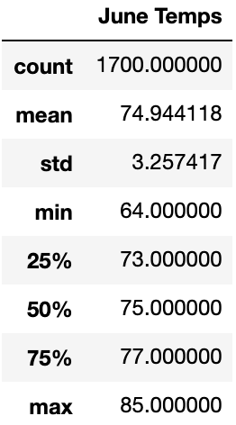
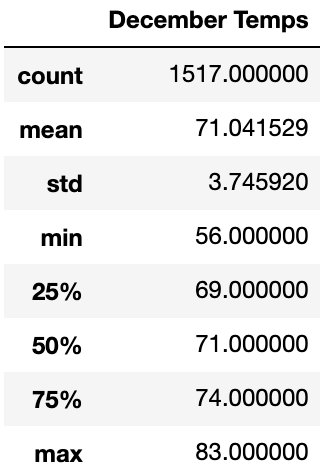

# Surfs_Up
Climate Analysis Project for UT Austin Data Analysis Bootcamp <br>

## Project Overview
We were asked to help decide if a Hawaiian surf shop that sells ice cream would be a worthwhile investment. The success of the surf shop will be dependent on the area's temperatures and precipitation. Too much rain will hurt the surf business, while cold temps will spoil customers' appetites for ice cream. We analyzed weather data on the island of Oahu to determine if the location would be suitable. <br>

## Resources
- Data Sources: hawaii.sqlite
- Software: Python, Pandas, SQLAlchemy, Jupyter Notebook

## Results
In order to determine the suitability of Oahu as a surf shop location we focused on data from the months of June and December. <br>
### - June Data
<p padding-left: 50px>We began our code by importing SQLAlchemy, then created a SQLite engine and reflected our tables into the new model. We created a session to link our Python code to the database then queried it. To filter the data for the month of June we used the SQLAlchemy "extract" function to find the month each measurement was taken. The code for the resultant query was: <br>
```python
results_june = session.query(Measurement.tobs).\
filter(extract('month', Measurement.date)==6).all()
```
We then used Pandas to create a dataframe from the results_june list. The "describe" function returned the following statistics: <br></p>
<p align ="center">
<br>
</p>
 <br>
<p padding-left: 50px>With a mean temperature of 75 degrees and a minimum temperature of 64 degrees, June would be an ideal month in which to sell ice cream.</p>

### - December Data
<p padding-left: 50px>We followed a similar pattern in December, writing the following query, only changing the month value to 12 instead of 6 to represent December: </p><br>
```python
results_dec = session.query(Measurement.tobs).\
filter(extract('month', Measurement.date)==12).all()
```
<p>The "describe" function gave us this table:</p>
<p align ="center">
<br>
</p>
 <br>
<p padding-left: 50px>With a mean temperature of 71 degrees and a minimum temperature of 56 degrees, December is still a great month to sell ice cream, even if it is slightly more chilly than June.</p>

### - Similarities and Differences
<p padding-left: 50px> Overall the temperatures for June and December were very similar, however there were some notable differences. The mean temperature is only four degrees cooler in December than June, but the minimum temperature is eight degrees cooler, which indicates that there are a number of days in December which dip below the June lows and which might cause people not to purchase ice cream. Furthermore, the standard deviation is higher for the December temperatures (3.75 compared to 3.25 for June), which tells us that there are greater swings in temperature during that month. Even though there may be similar average temperatures from month to month, the number of hours favorable for selling ice cream in December will be lower.</p>

## Summary
<p>This study has shown that the island of Oahu will be a great place to open an ice cream shop. Temperatures are warm and comfortable, and rarely dip to levels of discomfort. Even the December low of 56 degrees is a fairly comfortable temperature relative to many parts of the world. </p>
<p>To determine the suitability of the location for a surf shop, we will need to delve further into the climate data to ascertain the precipitation amounts for the months of June and December. Two additional queries would garner this information. First, we would query the database for the precipitation measurements, filtering for the month of June:
```python
precip_june = session.query(Measurement.prcp).\
filter(extract('month', Measurement.date)==6).all()
```
Next we would perform the same query for December:
```python
precip_dec = session.query(Measurement.tobs).\
filter(extract('month', Measurement.date)==12).all()
```
Once we have applied the "describe" function to this data we will be able to see the rainfall amounts on Oahu and decide if there are enough sunny days to justify opening a surf shop.</p>
